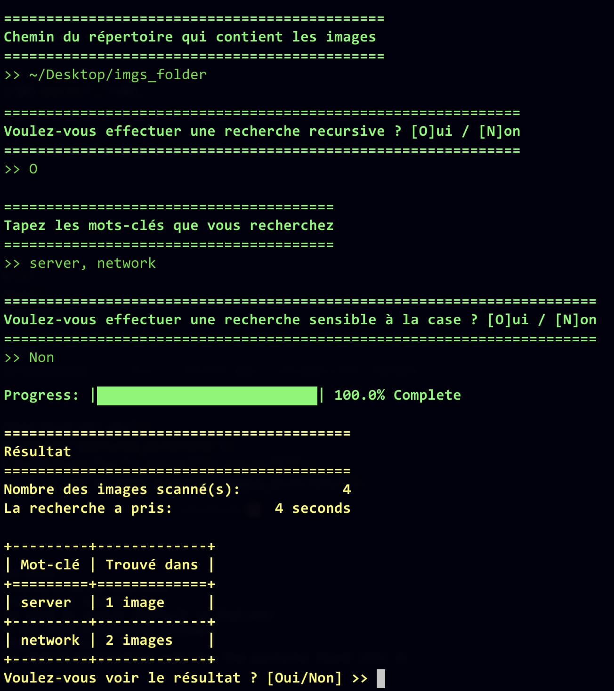

```
 _____          _         
|  __ \        | |        
| |__) |__  ___| | ___ __ 
|  ___/ _ \/ _ \ |/ / '__|
| |  |  __/  __/   <| |   
|_|   \___|\___|_|\_\_|                           
```

A Python tool to perform Optical Character Recognition (OCR) in a directory of images and search for specific text or phrases within the extracted text.


## 🚀 Features
- 🔍 Search for text within images using OCR
- 🖼️ Supports common image formats (`.jpg`, `.png`, `.jpeg`, etc.)
- 📁 Recursively scans a directory for images
- 📄 Outputs search results with image file names and matched text
- 🧠 Powered by [Tesseract OCR](https://github.com/tesseract-ocr/tesseract)

## 📦 Installation

### 1. Clone the repository

```bash
git clone https://github.com/abderrahimdotdev/peekr.git
cd peekr 
```

### 2. Create a virtual environment
```
python -m venv .venv
source .venv/bin/activate  # On Windows: .venv\Scripts\activate
```

### 3. Install Python dependencies
```bash
pip install -r requirements.txt
```

## 🛠️ Usage
Run the tool from the command line to perform OCR and search for text in images.

```bash
python -m peekr --directory /path/to/images --keyword "word1, word2"
```

To run in interactive mode:
``` bash
python -m peekr --interactive
# or
python -m peekr -I
```


| Argument      | Description                            | Example                    |
| ------------- | -------------------------------------- | -------------------------- |
| `-i, --interactive` | Run in interactive mode. | `-i`     |
| `-d, --directory` | Path to the images directory | `--directory ./images`     |
| `-h, --help` | Display the help page | `--help`     |
| `-c, --case-sensitive`     | Perform a case-sensitive search.          | `-c` |
| `-o, --output`      | The destination folder to copy the pictures found into.      | `-o ./new_dir`           |
| `-l, --lang`      | Language for OCR (default: `eng`)      | `--lang fr`           |
| `-r, --recursive` | Recursively search subdirectories      | `--recursive`              |
| `-k, --keyword`    | A comma-separated list of keywords to search for.      | `-k ""`     |

## ✅ Example Output


## 🧪 Requirements
- Python 3.13+
- `uv` (install via `pip install uv` or follow [installation instructions](https://docs.astral.sh/uv/getting-started/installation/))

## 📁 Project Structure

```bash
ocr-search-tool/
│
├── peekr
│   ├── peekr.py        # Main script
│   └── __init__.py
├── pyproject.toml      # Project metadata and dependencies
└── README.md           # Documentation
```

## 🧠 How It Works
  1. The tool walks through the specified directory.
  2. For each image, it uses Tesseract OCR to extract text.
  3. It searches the extracted text for the query string.
  4. Summary of matching results are printed to the console and optionally copied into a new directory.


## ❓ FAQ
- Q: Does this work on PDFs?
  - A: No, this tool is currently designed for images only. You can convert PDFs to images using tools like pdf2image.

- Q: Can I add fuzzy search or regex?
  - A: Yes! Contributions to support fuzzy matching or regular expressions are welcome.


## 🤝 Contributing
Contributions are welcome! Please open issues or submit pull requests for features, bug fixes, or enhancements.

<strong>Made with 💻 and ☕ by [Abderrahim](https://abderrahim.dev)</strong>